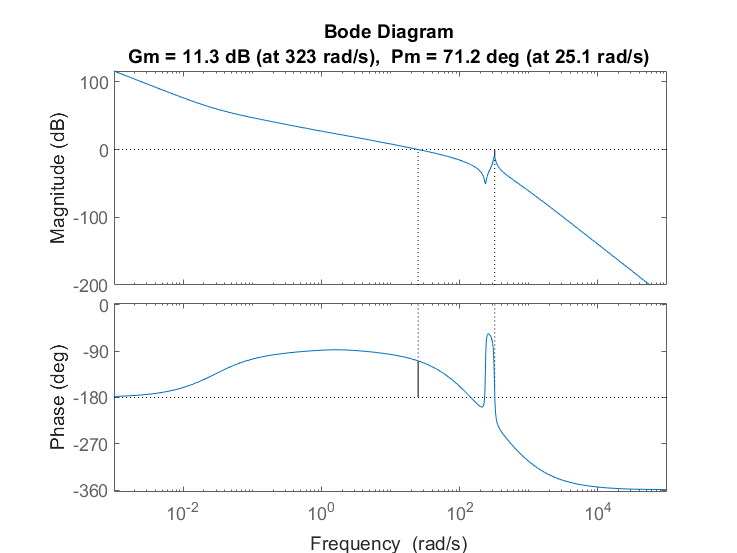
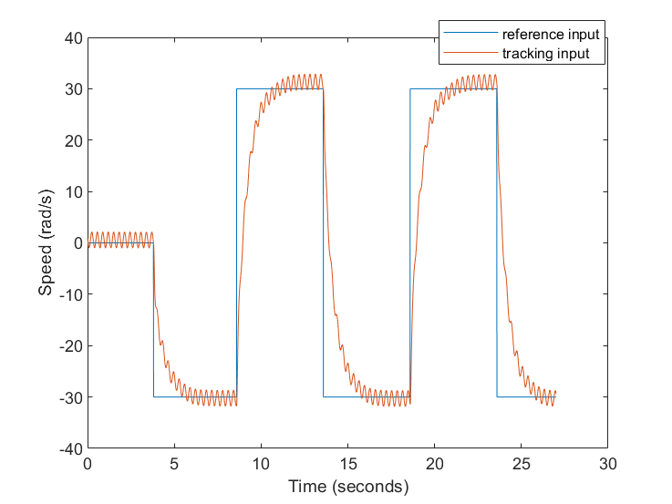
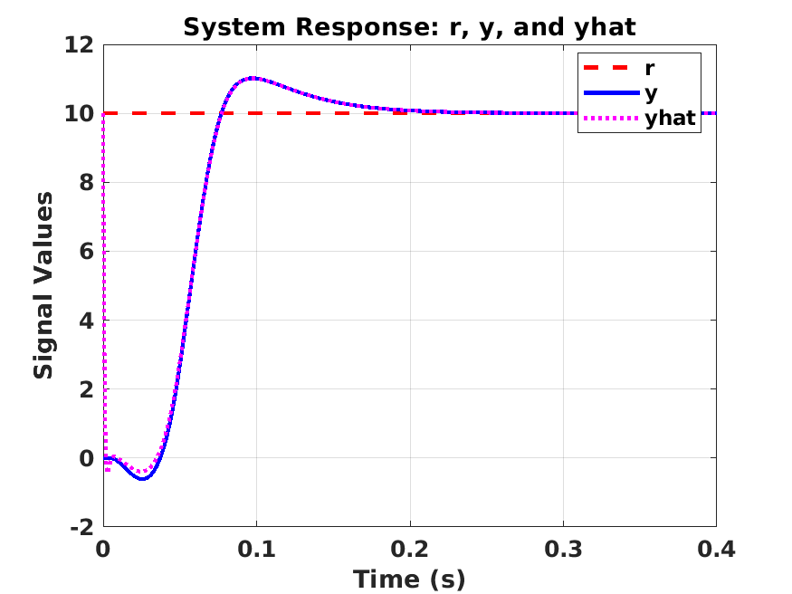

# Control Systems (5ESD0), TU/e

MATLAB and Simulink work for the Control Systems course (5ESD0) at Eindhoven University of Technology. The two labs cover the two main design approaches in the course: frequency-domain loop shaping on a rotating two-inertia motor setup, and state-space control (pole placement, observer, integral action) on a magnetic levitation system. Both labs go through modeling, controller design, closed-loop simulation in Simulink, and, for lab 1, comparison against measurements taken on the real hardware.

## Lab 1: frequency-domain control of a two-inertia motor

The plant is a motor driving two rotating inertias coupled by a flexible shaft (a mass-spring-damper style torsional system). Starting from the physical parameters (inertias, torsional stiffness and damping, motor constant, viscous friction), the plant transfer function from motor current to shaft angle is derived, including the lightly damped resonance of the two-inertia coupling.

A lead-lag controller `D` is designed by loop shaping against the open-loop frequency response, with a low-pass measurement filter `H` in the loop. The design targets adequate gain and phase margins, zero steady-state error to a step (through an integrator in the controller), and rejection of a sinusoidal disturbance. `condesign.m` builds the plant and controller and stores them for the Simulink models; the grader scripts compute the loop, complementary sensitivity, and steady-state error. The Simulink models (`RL_FA_controller_5ESD0`, `RL_FA_system_5ESD0`, `RL_FA_TOP_SIM_5ESD0`) run the closed loop, and `measurement_plots.m` overlays the simulated response on measurements recorded from the physical setup for step and square-wave references, with and without a bias and a sinusoidal disturbance.



Open-loop Bode diagram of the designed loop, showing a gain margin of 11.3 dB and a phase margin of 71.2 degrees. The dip near 300 rad/s is the shaft resonance.



Measured shaft speed tracking a square-wave reference on the hardware while a sinusoidal disturbance is injected. The controller follows the reference while attenuating the added ripple.

## Lab 2: state-space control of a magnetic levitation system

The plant is a magnetically levitated steel ball whose height is set by the coil current. The nonlinear model (electrical dynamics, gravity, and the position-dependent inductance) is linearized around an operating point at 10 mm ball height to obtain a state-space model in current, position, and velocity. `Grader_Assignment1.m` and `Grader_Assignment2.m` set up the nonlinear model and the linearized `A, B, C, D` matrices and compare the state-space and transfer-function step responses.

`controller_parameters_STUDENT.m` carries out the full state-space design: it checks controllability and observability, places the state-feedback poles with `place`, designs a Luenberger observer to reconstruct the states from the measured position, and augments the system with an integral state so the closed loop tracks a reference and rejects disturbances without steady-state error. The design is verified against rise-time, overshoot, and settling-time specifications and run in the Simulink models (`RL_ML_controller`, `RL_ML_System`, `RL_ML_TOP_SIM`).



Closed-loop response of the levitation height: reference `r`, measured output `y`, and observer estimate `yhat`. The estimate converges to the true output within a few milliseconds, and the output settles to the reference with a small overshoot.

## Additional scripts

`nyquist.m` and `stability.m` at the repository root are separate exercises: a Nyquist plot of an example open-loop transfer function, and a comparison of the sensitivity, complementary sensitivity, and loop transfer functions on Bode plots for an uncompensated and a lead-compensated loop.

## Repository layout

```
lab1/  frequency-domain loop shaping (two-inertia motor)
  Simulink_stuff/  plant and controller design (condesign.m) and Simulink models
  Measurements/    hardware measurement data and overlay plots
  Report/          exported Bode, margin, and step/square response figures
lab2/  state-space control (magnetic levitation)
  Software_Lab2/   linearization, pole placement, observer, integral action, Simulink models
nyquist.m, stability.m  standalone Nyquist and sensitivity exercises
```

## Running

The scripts run in MATLAB with the Control System Toolbox and Simulink. In lab 1, run `condesign.m` to build the plant and controller into `controller.mat` before opening `RL_FA_TOP_SIM_5ESD0.slx`. In lab 2, `controller_parameters_STUDENT.m` computes the gains and launches `RL_ML_TOP_SIM.slx` at the end. The `.mat` files hold measurement recordings and bus definitions used by the models.

## Technologies

- MATLAB
- Control System Toolbox (`tf`, `bode`, `margin`, `nyquist`, `place`, `ctrb`, `obsv`, `ss`)
- Simulink (plant, controller, and top-level simulation models)
